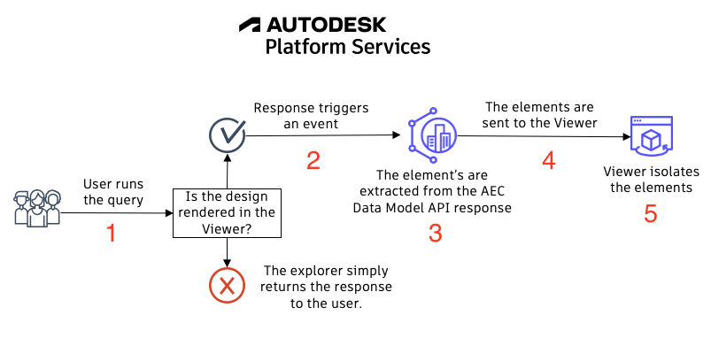

# Connecting with Viewer and Advanced Queries

In this section, we'll understand how the explorer connects the elements retrieved from the response with the elements rendered with the Viewer.
After this, we'll explore more complex workflows supported by then AEC Data Model API.
Let's begin with Viewer.

## Connecting with Viewer

Every time you run a query against a specific design and the same design is rendered in the Viewer, the elements from the response are isolated in the Viewer scene.
To understand the process, let's analyze the diagram below:

1.
2.
3.
4.
5.

[Next Step - Additional Workflows]({{ site.baseurl }}/workflows/home/){: .btn}
