# Explorer and First Queries

Now that you're in good shape to use the AEC Data Model API, we can start experimenting with the queries and the explorer to get more comfortable with this new service.

In this section, we'll introduce you to the interface that will help you explore your design data, focusing mainly on the API. As said before, we don't want you to worry about frameworks, coding, and cloud providers. We can keep it simple using the [explorer](https://aecdatamodel-explorer.autodesk.io).

The explorer's UI was built to be simple and intuitive. We'll use it mostly to perform our queries by passing the payload and checking the response, just like in the image below:

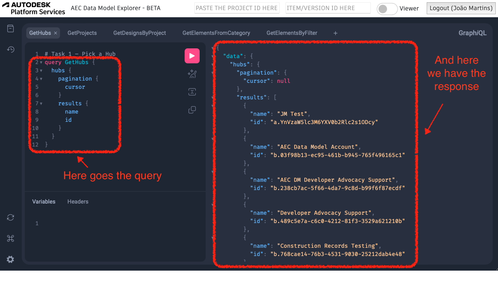

> _The explorer is built on top of the [graphiql](https://github.com/graphql/graphiql) project! If you want additional details on this project, feel free to check its documentation ;)_

It also comes with multiple functionalities to check the history of queries, format queries, configure themes and shortcuts, and a button to display the queries available with the API. This last option is the first one we'll go through, as it provides us access to our API schema. This will be our entry point. We'll start our journey by getting familiar with the AEC Data Model API schema.

## AEC Data Model Schema

As described at [graphql.org](https://graphql.org/learn/schema/):

> _"Every GraphQL service defines a set of types which completely describe the set of possible data you can query on that service. Then, when queries come in, they are validated and executed against that schema."_

Our API has a schema suitable to address the common data from the AEC industry. It's composed of the 5 constructs described below:

- **Design**: A Design is a part of an AEC project that contains elements. Note that “Model” is sometimes used interchangeably with “Design”.
- **Elements**: An Element is a building block of AEC design data. It represents an individual piece of an AEC design such as a wall, window, or door without enforcing a rigid definition. The absence of a rigid definition allows the Element to be flexible to adapt to the different requirements of an AEC design, now and in the future. The data contained in an Element gives it context by using Classification, Property, and Property Definition.
- **Reference Property**: A reference property describes the relationship between elements.
- **Property**: A Property is a well-defined granular piece of data that describes the Element. For example: Revit parameters and their values like area, volume, length, etc.
- **Property Definition**: A Property Definition provides detailed information about a Property. It contains metadata that gives context to the Property. For example: Unit, type, etc.

### Explorer Docs

Now let's use the explorer to view our schema.

Log in with your Autodesk account, then click on the Docs button and scroll down to access the queries available in the AEC Data Model's schema.

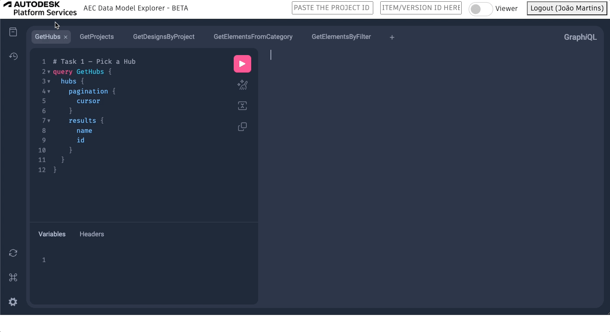

The first query we used in the previous section returned to us a list of hubs. According to this documentation we could, for instance, use a filter to retrieve only the hubs matching certain conditions. Exploring the schema gives us a better idea about the capabilities of the API. If you scroll down you'll see a list with all the queries available including the parameters that can be passed to compose the responses.

### GraphQL Voyager

> There's also another great tool to explore GraphQL API's schemas:
> The [GraphQL Voyager](https://graphql-kit.com/graphql-voyager/)

To try this tool, you just need to go through the three steps below:

- Go to the Voyager page, click on change the schema, and copy the introspection query

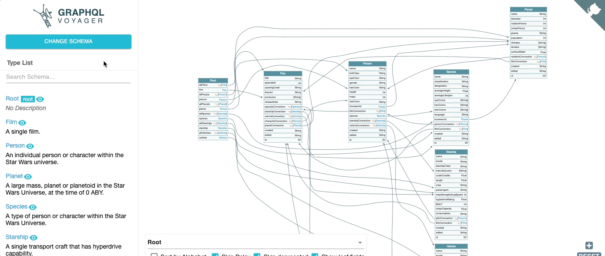

- Paste and run the query in the AEC Data Model Explorer

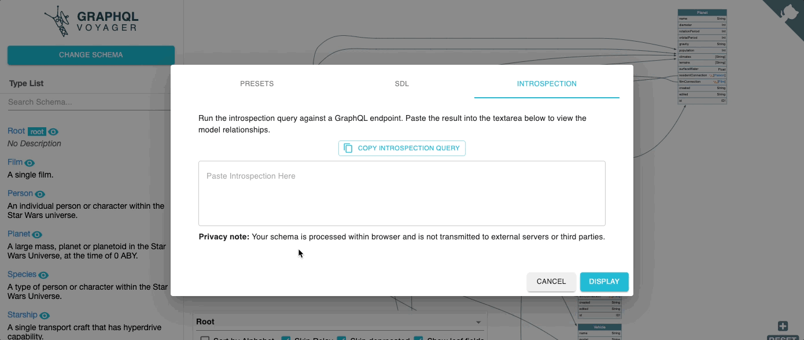

- Copy the response, paste it back in the Voyager app and click in the `DISPLAY` button

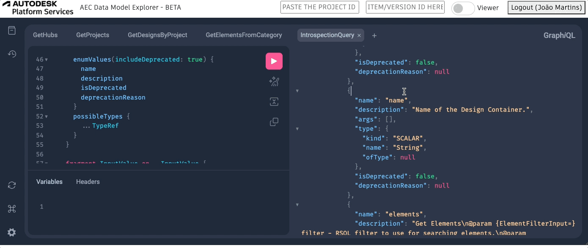

With that you will be able to inspect all the available queries and constructs from AEC Data Model API.

> _Keep one tab with the schema open for further exploration throughout this tutorial ;)_

Now that we know the schema's importance and know how to view it using the explorer, we can continue with the subsequent queries.

## First Queries

We suppose that you're familiar with how the data is organized in the context of ACC hubs but if not, here is a quick overview:

At the top level, there are the hubs.
Inside each hub, there are the projects.
Inside a project, there are multiple folders.
Inside a folder, there can be other folders or items.
Lastly, an item can have multiple versions.

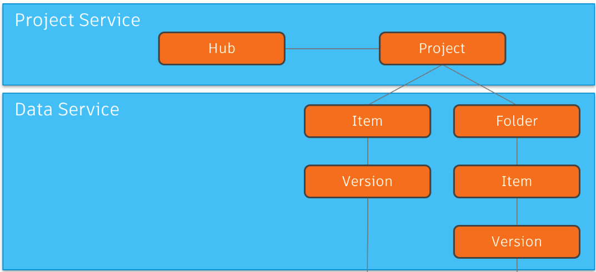

Let's traverse this structure through our queries in 4 steps:

### Step 1 - Listing the hubs

The query to retrieve the hubs is quite simple and it is available in the first pane of the explorer. To list the hubs available you just need to click in the first panel of the explorer and then run the query, like the gif below:

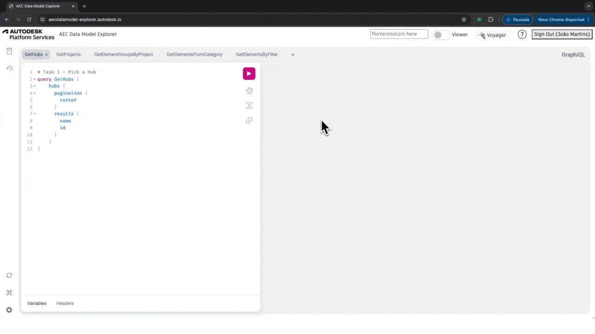

Now make sure you can see the hub you used to join the AEC Data Model beta listed in the response and move to the next query.

This tutorial will move to the next steps using the hub named `AEC DM Developer Advocacy Support`.
In the next query, you'll need to use your hub id as input.

> _This id is the same one used by other APS APIs (ACC and Data Management) to point to hubs._

### Step 2 - Listing the projects

Following the hierarchy, we're going to list all of the projects available inside one hub. For that, we'll need to provide the hub id as input for the get projects query.

Go ahead and copy the id of the hub you're using, move to the `GetProjects` pane, and paste the id in the proper field, just like in the gif below:

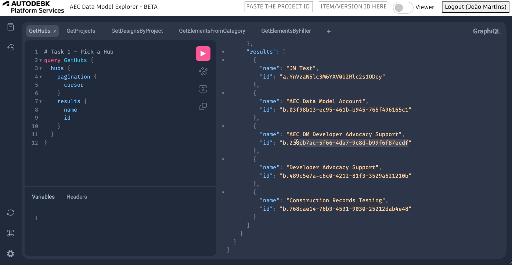

Now you'll need to find the project that hosts your Revit 2024 designs for this tutorial.

This tutorial uses the project `AEC DM Bootcamp Project`, which is already visible on the first page of the response.

The GetProjects query available in the explorer, as is, requires you to paste the `hub id` as a string argument, but you can also asign that using the Variables.

Using Variables instead, the query would be just like the one below:

```js
query GetProjects ($hubId:ID!) {
  projects(hubId: $hubId) {
    pagination {
      cursor
    }
    results {
      id
      name
      alternativeRepresentations{
        externalProjectId
      }
    }
  }
}
```

And in Variables space, the id of the hub:

```js
{
  "hubId": "YOUR HUB ID HERE!"
}
```

This way is better to address variables as they can be assigned multiple time easier at any place in the query, and we don't need to change any value in the query to point to a different hub.

In case your hub has many projects making the one you need to use missing from the first page (or even hard to find), there's a way to filter the response.

For that you can filter the projects by name, passing the name of your project like the gif below:

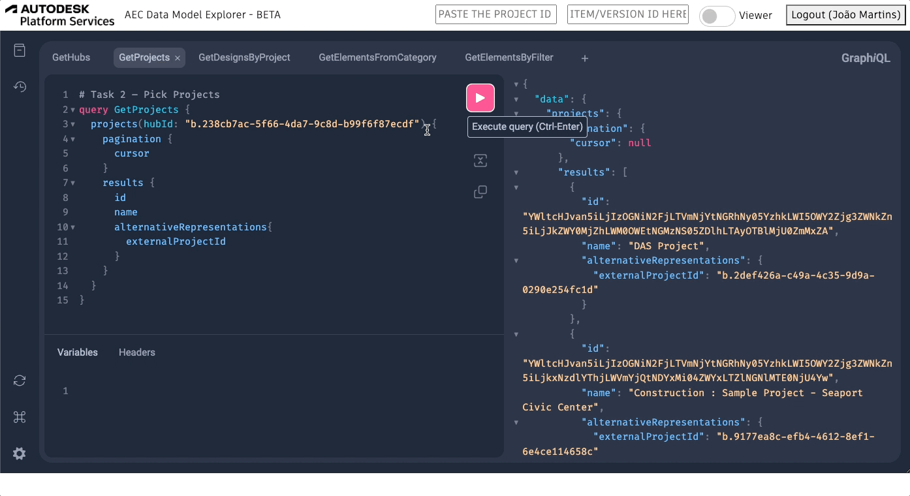

For simplicity, you can just copy and paste the query below if needed (replacing it with your project name and hub id) ;)

```js
query GetProjects ($hubId:ID!, $projectName:String!) {
  projects(hubId: $hubId, filter:{name:$projectName}) {
    pagination {
      cursor
    }
    results {
      id
      name
      alternativeRepresentations{
        externalProjectId
      }
    }
  }
}
```

```js
{
  "hubId": "YOUR HUB ID HERE!",
  "projectName": "YOUR PROJECT NAME HERE!"
}
```

The next query requires a project id, and AEC Data Model API works with its unique value for the project id. That's why it exposes the usual project id inside the `alternativeRepresentations` field.
We are not going to use the alternative representation for the projects in this tutorial but is always good to know how to retrieve it. You'll need it if you want to connect with ACC APIs or Data Management APIs, for instance.

### Step 3 - Listing Designs

Usually inside a project, we have a complete structure of folders separating files according to project phase, disciplines, teams, etc...
You might be used to traverse this folder structure to reach your items level, but that isn't necessary when we use AEC Data Model API.

There are queries that list designs from a project and even from a hub.
Obviously, by limiting the container the response is more precise, avoiding the need to go through multiple pages or filtering.

In this step we'll focus on listing all the designs available in one specific project, using the desired project id.
For that, we just need to copy the project id from the previous step response, move to the `GetDesignsByProject` pane, and paste the project id into the `GetDesignsByProject` query. Just like in the gif below:


The response for this request will only list **AEC Designs** generated from the Revit 2024 files uploaded in your hub. Since we're using a small set of files, there's no need to go through pagination.

> _Feeling comfortable with GraphQL already? Why don't you try changing this query to use variables insted of "hardcoded" arguments? ;)_

If you notice the response for one specific design, you'll see that it contains the `alternativeRepresentations` field. In this case, we are retrieving both **item Id** and **version Id**. We'll use the **version Id** to load the derivative for this design with Viewer while the `id` returned in the response is used in the next query.

Before moving to the next query, we need to load the `Snowdon Towers Sample Facades` in Explorer's Viewer.

This is quite simple to achieve ;), you just need to copy and paste the version id (available in the field `fileVersionUrn` inside the alternativeRepresentations) in the second input from the page's header and flick the switch to turn on the Viewer. Just like in the gif below:

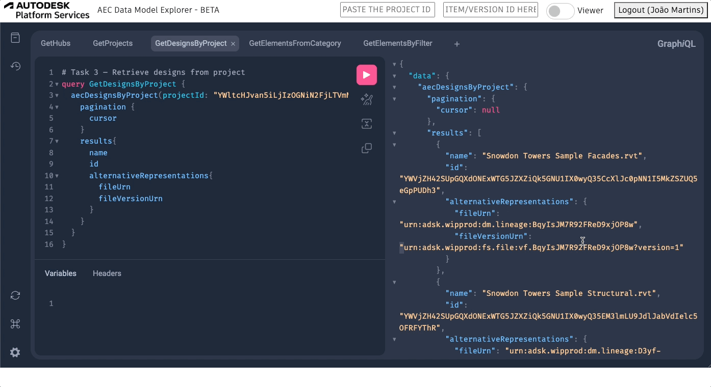

### Step 4 - Listing Elements

Now we can explore the components from our designs. In the last query of this section, we'll retrieve the elements from specific categories through the supported filters.

Copy the design id from the `Snowdon Towers Sample Facades` available in the previous response and pass it to the `GetElementsFromCategory` query, just like in the gif below.

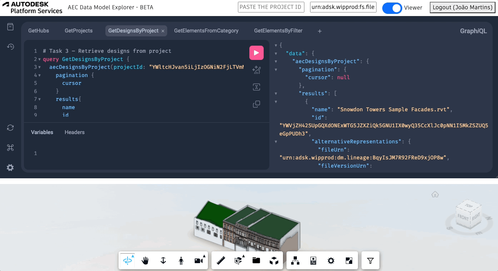

This query lists all the elements based on their **category**. The filter applied:

```js
filter: {
  query: "property.name.category==Walls";
}
```

Retrieves only elements from the **Walls** category.

By default, the **Elements** query is limited to listing only the first 50 elements, so it doesn't list all the walls from our design.

> _Refer top the table below (also available in the docs)_

| Used by query | Description                                                                                                                                   | Default limit | Maximum limit |
| ------------- | --------------------------------------------------------------------------------------------------------------------------------------------- | ------------- | ------------- |
| hubs          | Contains a list of hubs returned in response to a query. A hub is a container of projects, shared resources, and users with a common context. | 100           | 200           |
| projects      | Contains a list of projects returned in response to a query.                                                                                  | 100           | 200           |
| folders       | Contains a list of hubs returned in response to a query. A hub is a container of projects, shared resources, and users with a common context. | 100           | 200           |
| aecDesigns    | Contains a list of object representing versions of drawings, typically returned in response to a query.                                       | 50            | 100           |
| version       | Contains a list of object representing versions of drawings, typically returned in response to a query.                                       | 50            | 100           |
| elements      | Contains a list of object representing elements of a specific aecdesign.                                                                      | 50            | 500           |
| properties    | Contains a list of object representing properties of a specific element.                                                                      | 100           | 500           |

So let's improve our response by tweaking it a little bit.
We can change the default limit, returning to us the first 100 elements instead of only 50. We can also filter a bit more to return only the **instances**. In the current response, there are both types and instances. Since we're more interested in the latter for viewing, let's filter our response to only list instances.

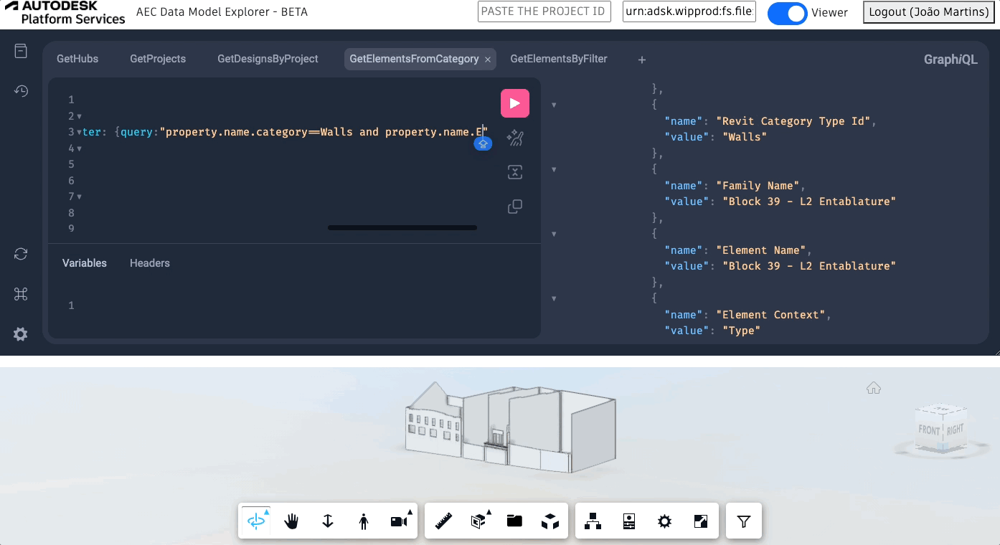

The query will be just like the one below:

```js
query GetElementsFromCategory {
  elements(designId: "YOUR DESIGN ID HERE!",
  filter: {query:"property.name.category==Walls and 'property.name.Element Context'==Instance"},
  pagination:{limit:500}) {
    pagination {
      cursor
    }
    results {
      id
      name
      properties {
        results {
          name
          value
        }
      }
    }
  }
}
```

> _Once more, feel free to change this query to use variables insted of "hardcoded" arguments? ;)_

Now imagine that in your workflow, the resulting elements are referred simply as Walls as they are from the Walls category.

Using **Aliases** you can change the elements field name to anything that you need.

Using the query below, instead, you'll retrieve the elements named as Walls:

```js
query GetElementsFromCategory {
  Walls: elements(designId: "YOUR DESIGN ID HERE!",
  filter: {query:"property.name.category==Walls and 'property.name.Element Context'==Instance"},
  pagination:{limit:500}) {
    pagination {
      cursor
    }
    results {
      id
      name
      properties {
        results {
          name
          value
        }
      }
    }
  }
}
```

And with that, we covered the first queries with the AEC Data Model API.
In the next step, we'll understand how this connection with the viewer works and explore more complex queries.

[Next Step - Connecting with Viewer and Advanced Queries](../../connection/home/){: .btn}
