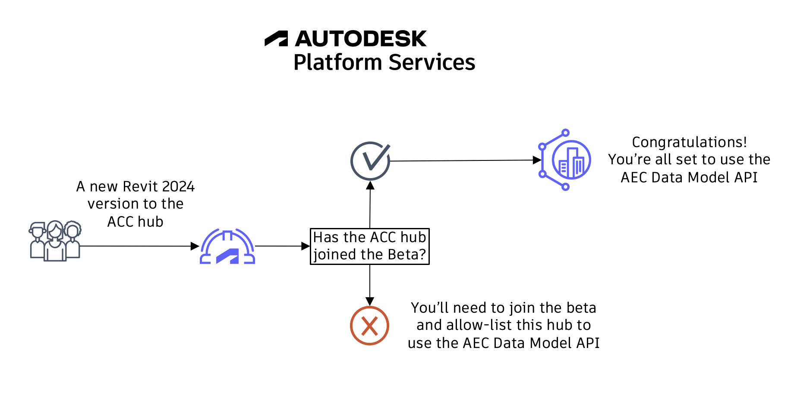
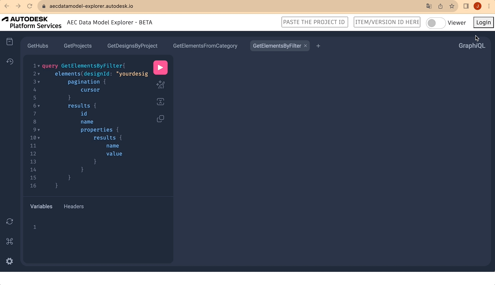

# Prerequisites

Before jumping into action, you need to fulfill a few (but essential) prerequisites to follow along with this tutorial. **The steps need to be fulfilled in sequence for you to be able to follow this tutorial (only move to the next step after completing the previous one)**:

1. Firstly, you will need an ACC account from the **AMER region**. The AEC Data Model API works based on Revit 2024 designs hosted on ACC hubs in the **AMER region** , so it is **required**. Although the scope of this tutorial is just reading data, we recommend that you create a separate project for testing the AEC Data Model API. If you don't have access to an **AMER ACC hub**, you can find options for getting a test account on [this blog](https://fieldofviewblog.wordpress.com/2017/08/31/bim-360-acc-account-for-development/). **Make sure you now have access to an ACC hub in the AMER region and only then proceed to the next prerequisite.**

2. Once you get access to your hub, you'll need to enable it to generate AEC Designs from uploaded Revit 2024 files. To make this possible, **the account owner** of the ACC hub you're interested in using needs to [join the AEC Data Model API beta](https://feedback.autodesk.com/key/AECDataModelPublicBeta). **We recommend doing this as soon as possible as this process might take up to three business days and after that, there are still prerequisites to be fulfilled before the bootcamp. So, please reach out to your ACC hub owner and ask him/her to [join the AEC Data Model API beta](https://feedback.autodesk.com/key/AECDataModelPublicBeta) as soon as possible!** After your ACC account gets enabled, every time you upload a new Revit 2024 file to your hub, it will generate one equivalent AEC Design. This only works against files uploaded **after your hub is allow listed**. Please, reach out to us in case it takes longer than expected. The process works just like in the diagram below:

   

3. With the first two steps covered, it's time to make our design data ready to use with the AEC Data Model API. For our tutorial, we prepared a subset of files that you can download [here](https://acc.autodesk.com/docs/share/projects/ddcecd34-68b7-41af-ad65-2ce571186c6c/files?shareId=f9b940e2-12b2-4617-9a87-630451008498). You just need to download the .zip file, unzip it, and then upload the Revit files to your account **at least one week before the tutorial date**. We are asking this because the translation process can take some time and if everyone uploads all their files without enough time, some designs may not get translated in time. If your account is allow listed, please go ahead, **[download the files](https://acc.autodesk.com/docs/share/projects/ddcecd34-68b7-41af-ad65-2ce571186c6c/files?shareId=f9b940e2-12b2-4617-9a87-630451008498), and upload them to a known project in your ACC AMER account** as soon as possible. After that, you can move to our last prerequisite (we're almost done ;)).

4. You'll also need to [provision access in your ACC hub](https://tutorials.autodesk.io/?check_logged_in=1#provision-access-in-other-products) to the client id `HKVjhUXySDGLGJimolxAgDdpoCuZLlql`. This is the client id of the APS app used by the [explorer](https://aecdatamodel-explorer.autodesk.io/) that we'll be using in this tutorial.

Now let's cover a quick introduction on GraphQL.

# GraphQL

The way the AEC Data Model is structured makes it a perfect match for GraphQL.

For those unfamiliar, it is a query language for APIs.
It Provides a complete and understandable description of the data in your API, and gives you the power to ask for exactly what you need and nothing more.

GraphQL is much easier to use than REST, but it requires a better understanding of data structures​.

With a single endpoint, data fetching is easier because you don't need to make requests to multiple endpoints to get a set of data.

The request specifies precisely the data that’s going to be returned

Let's compare a case where we need to check the length of a specific element in a specific version of a specific design.

With the AEC Data Model GraphQL endpoint, the query looks like this:

```js
query {
  aecDesignByVersionNumber(designId: "YWVjZH5...EpfSHZ3", versionNumber:1) {
    elements(filter:{query:"'property.name.External ID'==41434aa5-...-0018527b"}){
      results{
        properties(filter:{names:["Length"]}){
          results{
            name
            value
            propertyDefinition{
              units
            }
          }
        }
      }
    }
  }
}
```

And the response for this query will look like this

```js
{
  "data": {
    "aecDesignByVersionNumber": {
      "elements": {
        "results": [
          {
            "properties": {
              "results": [
                {
                  "name": "Length",
                  "value": 11.000000000000002,
                  "propertyDefinition": {
                    "units": "Meters"
                  }
                }
              ]
            }
          }
        ]
      }
    }
  }
}
```

Note that in this case we specified that we wanted to obtain the AEC Design with id `YWVjZH5...EpfSHZ3` from version `1`.
From this design, we specified the element with `External Id` equal to `41434aa5-...-0018527b`, and from this element, we retrieved the property with a name equal to `length` including its **value**, **name**, and **unit**.

With REST API we would need additional requests, and wouldn't be possible to specify with this precision the data in the response.

To summarize, with GraphQL we have the benefits below:

- Single REST API endpoint – You only need to send your query to this endpoint when coding it in your applications
- No fixed Structure for the exchange of data – as compared to the Model Derivative REST API, where you will get a large JSON dataset, that you need to understand and be able to find the data you are looking for
- No over-fetching – as compared to the Model Derivative REST API, where you may need to call various APIs several times to get the data you are looking for.
- Efficiently using resources – Because the GraphQL implementation is on the Autodesk server side, it handles the requests to get the data you are asking for. This minimizes the traffic and allows us to optimize without disruption to the GraphQL aspects.

Before moving to the next step, let's run our very first query.

For that, you just need to go to the explorer app at `https://aecdatamodel-explorer.autodesk.io/`, log in, and run the query from the very first panel (GetHubs), just like in the image below:



If you don't see your ACC hub listed, please double check step 3.
Once you see your hub, you can move on to the next step.

> _We'll get back to GraphQL syntax throughout the queries in the next section. As it's not like the usual REST requests, we'll cover the differences and possibilities in parallel, while also learning the supported AEC Data Model API queries._

[Next Step - Explorer and First Queries](./explorer/home/){: .btn}
