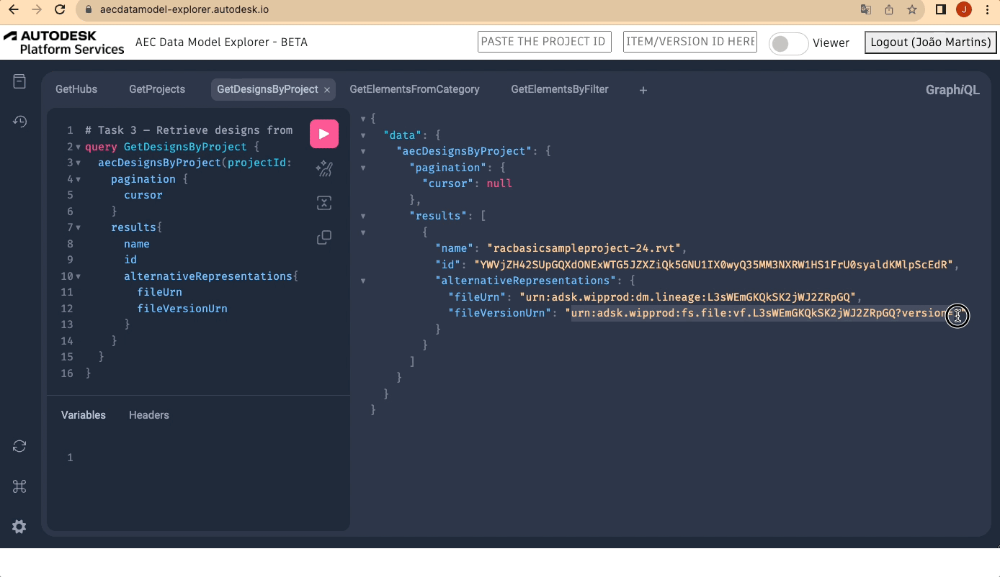

---
# Feel free to add content and custom Front Matter to this file.
# To modify the layout, see https://jekyllrb.com/docs/themes/#overriding-theme-defaults

layout: home
title: Home
permalink: /
nav_order: 1
---

# AEC Data Model API Tutorial

## Introduction

In this tutorial, we'll cover the first steps in your journey with the AEC Data Model API in a quick and simple way. At first, we'll go through the prerequisites required to make everything work, and then we'll have a basic introduction to the GraphQL interface (used by this API).

Once we get that covered, we'll run from basic queries to more advanced ones, always using the explorer, just like in the image below.

<!--  -->

You don't have to worry if you're not a full-stack web developer as you won't need that level of expertise to follow up on this tutorial (although it's required to connect with one to build your own app leveraging our APIs).

As long as you are familiar with Revit designs and ACC data structures, and curious about new technologies, you're in good shape to go through the contents shared here.

This tutorial is divided into 4 main steps:

1. [Requisites and GraphQL]({{ site.baseurl }}/requisites/home/)

2. [Explorer and First Queries]({{ site.baseurl }}/explorer/home/)

3. [Connecting with Viewer and Advanced Queries]({{ site.baseurl }}/connection/home/)

4. [Additional Workflows]({{ site.baseurl }}/workflows/home/)

We'll start ensuring that everyone addresses the prerequisites.

[Next Step - Prerequisites and GraphQL]({{ site.baseurl }}/prerequisites/home/){: .btn}
